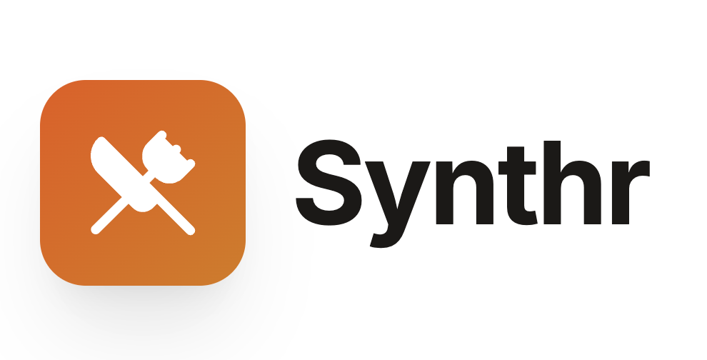

<p align="center">
  
</p>

# Synthr

**Synthr** is an AI-powered website builder that generates complete websites from structured business information. Instead of manually designing pages, users can describe their business, choose a style and tone, and instantly generate a fully structured HTML website.

The goal of Synthr is to simplify website creation by combining structured user inputs with AI-driven content and layout generation.

---

# Overview

Synthr allows users to generate ready-to-use website HTML by entering business details such as name, location, services, and branding preferences.

The AI processes this information and generates a clean, structured website that may include sections such as:

* Landing / hero section
* About the business
* Menu or services
* Contact information
* Business hours
* Location and maps
* Events or catering options

This enables users to create professional-looking websites quickly without needing to manually design layouts or write content.

---

# Features

### AI Website Generation

* Generates full HTML websites based on structured business inputs.
* Produces organized sections including headers, service descriptions, and contact pages.

### Structured Business Inputs

Users can provide detailed information including:

* Business name
* Business type
* Tagline and descriptions
* Contact information
* Business hours
* Location and address

---
# Tech Stack

Synthr uses a modern full-stack architecture.

### Frontend

* **React**
* **TypeScript**
* **Vite**
* **React Router (`react-router-dom`)**
* **Lucide React** for icons

### Styling

* Generated websites use **Tailwind CSS via CDN**

### Backend

* **Node.js**
* **Express**
* **TypeScript (`ts-node`)**

### AI Integration

* **Groq API** using `groq-sdk`
* Uses `GROQ_API_KEY` stored in environment variables

### Development Tooling

* **Vite Dev Server**
* **Concurrent client + server development using `concurrently`**
* **Proxy setup to forward `/api` requests to the Express server**


### Restaurant & Service Business Support

Synthr supports additional fields tailored for restaurants and similar businesses:

* Menu sections
* Cuisine type
* Price range
* Online ordering options
* Reservations
* Delivery / takeout availability

### Branding Customization

Users can adjust the style and tone of the generated website:

* Visual style
* Brand tone
* Custom instructions for AI generation

### Business Operations

Additional features include:

* Event hosting
* Catering services
* Weekly specials
* Private event capacity

### Location & Accessibility

Generated websites can include:

* Google Maps links
* Parking information
* Neighborhood descriptions

### Social Integration

Users can add social media links to their generated website.

---

# How It Works

1. The user enters business information into the Synthr interface.
2. The frontend sends a request to the backend API.
3. The backend constructs an AI prompt using the provided data.
4. The AI model generates a structured HTML website.
5. The generated HTML is returned and displayed as a preview.

---

# Project Architecture

Client-server architecture:

```
Frontend (React + Vite)
        |
        |  API Request
        v
Backend (Express + Node.js)
        |
        |  AI Prompt
        v
Groq API
        |
        v
Generated HTML Website
```

---

# Project Structure

```
/client
  /components
  /pages
  /services
  /types

/server
  server.ts
  routes
  ai-generation

/public
```

### Key directories

* **services** – handles API communication
* **types** – TypeScript definitions for business data
* **components** – reusable React UI components
* **server** – Express backend and AI generation logic

---


# Author

**Vandit Bhatia**

---

# License

MIT License
